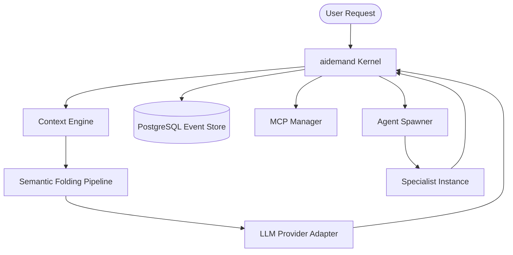

# Architectural Specification: aidemand Kernel

aidemand is architected as a modular, event-driven orchestration layer for autonomous agent execution. The system prioritizes immutability, context optimization, and provider agnosticism.

## 1. System Topology

The kernel operates as a stateful middleware between an arbitrary inference provider and the client application.

## 2. Core Components

### 2.1 Context Optimization Engine
To maintain high performance within fixed token windows, the kernel implements a two-stage optimization pipeline:
1.  **Observability Analysis**: The `TokenBudgetManager` monitors cumulative consumption per turn and session.
2.  **Semantic Folding**: Blocks exceeding 1500 characters (typically tool results) are truncated into a structured technical object. This object retains the semantic head and tail of the original data, ensuring the model identifies the execution outcome without context bloat.

### 2.2 Event-Sourced Persistence Layer
The persistence logic utilizes PostgreSQL as an immutable write-ahead log of all conversation events.
- **Traceability**: Each message is linked via `parent_message_id`, enabling non-linear history reconstruction (branching).
- **Session Management**: Conversations are aggregated by `session_id`. Sub-agents spawned during delegation are linked via `parent_session_id`.

### 2.3 Multi-Agent Orchestration (Swarm)
The orchestration layer facilitates complex task execution through recursive instances:
- **Least Privilege**: Specialist instances are spawned with a subset of tools restricted to the delegated task.
- **Transcript Summarization**: Results from specialized instances are returned as technical transcripts, preserving the coordinator's context window.

## 3. Resilience and Sanitization
The `Resilience Engine` ensures stability across different LLM providers:
- **Argument Normalization**: Intercepts and repairs malformed tool call arguments.
- **Schema Sanitization**: Strips incompatible JSON Schema decorators to ensure compatibility with strict provider APIs (e.g., Anthropic, OpenAI).
- **Circuit Breaking**: Monitors tool execution health and prevents recurrent failures from exhausting compute resources.

## 4. Operational Requirements
- **Persistence**: PostgreSQL 15+ (Internal Event Sourcing model).
- **Connectivity**: Support for Model Context Protocol (MCP) via Stdio and SSE.
- **Diagnostics**: Periodic health checks via the `Doctor` module.

---
© 2026 aidemand Core Engineering. Immutability. Optimization. Resilience.
